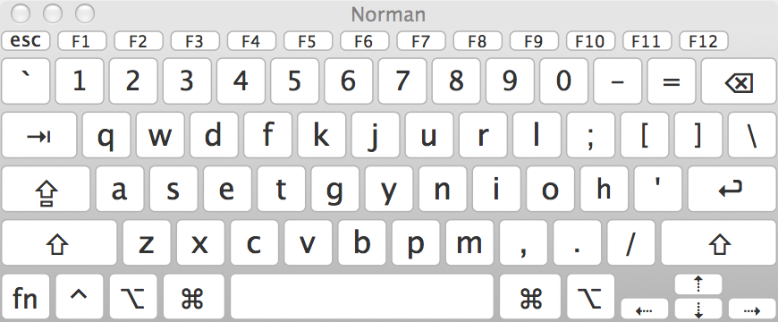
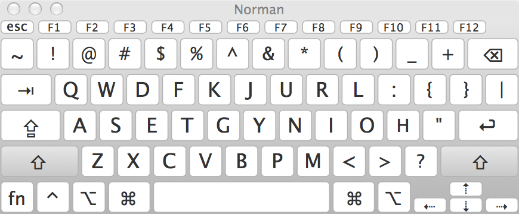
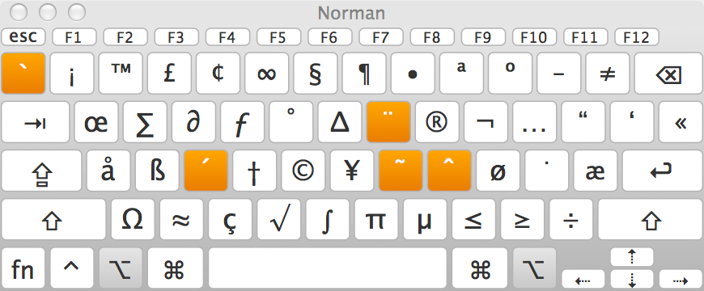
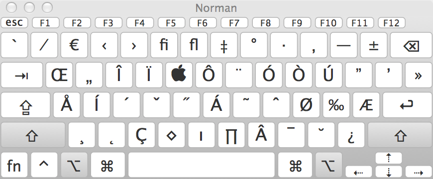

Norman keyboard layout
========================

Source files and alternate layouts for the Norman keyboard layout by David Norman (deekayen).

## Windows installer

http://normanlayout.info/files/Norman.zip

## Mac OSX installer

http://normanlayout.info/files/Norman.dmg

## Ubuntu Linux configuration

https://help.ubuntu.com/stable/ubuntu-help/keyboard-layouts.html

## Android Keyboard (through AnySoftKeyboard)
See [Android's README](android/README.md).

## Key assignments

### Shift ⇧

### AltGR ⌥

### Shift AltGR ⇧+⌥

