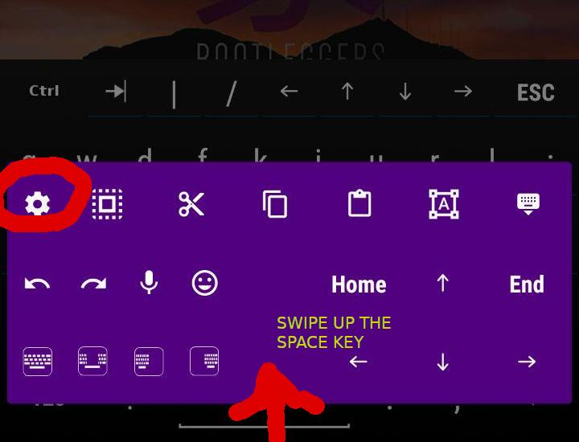
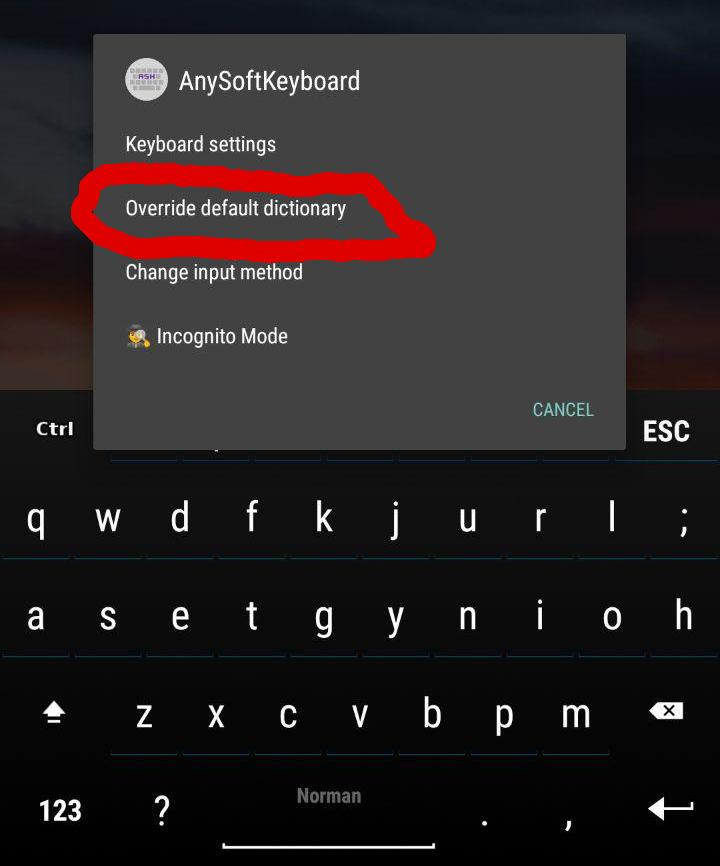

# How to install the keyboard for usage with AnySoftKeyboard

This keyboard comes with the English dictionary pre-activated. You are able to override this configuration to:

- Disable the built-in English dictionary
- Add another dictionary and use both simultaneously

For that, see the extra topics at the bottom

## Steps for using Norman with AnySoftKeyboard

1. Install AnySoftKeyboard

You'll be able to get the APK in one of those ways
- Through the F-Droid store
- Through Google PlayStore
- Through the project's [Github's release page](https://github.com/AnySoftKeyboard/AnySoftKeyboard/releases) - just download the latest app-release.apk and install it

2. Install the English language pack pre-built with Norman

*Do not worry about this being an "English" language pack as you'll be able to use with whatever language you want by overriding the dictionary.*

The pre-built addon for enabling Norman is distributed through [NormanAddonAnySoftKeyboard.apk](NormanAddonAnySoftKeyboard.apk).

*PS;* It is pre-built for the sake of getting it without having to setup the Android APK and compile for people who don't have it, but you'll be able to compile it by yourself in the below repository if you so choose.

The source for building the language pack is in this repository:

https://github.com/resolritter/NormanLayoutAnysoftKeyboard

3. Go into **AnySoftKeyboard** -> **Languages** (the "globe" icon in the bottom row) -> **Enable keyboards and languages**, and choose Norman.

---

## (Optional) Custom dictionary configuration

If you plan to use the keyboard to write in another language other than English, you'll want to override the dictionary configuration.

1. Swipe up the space key to get to the keyboard's menu, then click the gear icon

2. Select **Override default dictionary**

As for getting the extra dictionaries, you'll need to install the language addons from the stores or build them yourself from [LanguagePack](https://github.com/AnySoftKeyboard/LanguagePack).

## (Optional) Change the special press-and-hold symbols for each key

This will require you to modify the source code and recompile the APK.

See the repository for instructions on how to do this.

The source for building the language pack is in this repository:

https://github.com/resolritter/NormanLayoutAnysoftKeyboard
